<p align="center">
  
</p>

<h1 align="center">ED Multi Route Navigation (EDMRN)</h1>

<p align="center"><strong>Plan smarter. Fly less. Explore more.</strong></p>

<p align="center">
  <a href="https://github.com/NinurtaKalhu/Elite-Dangerous-Multi-Route-Optimizer/releases"><strong> Download EDMRN</strong></a>
  &nbsp;-&nbsp;
  <a href="#-screenshots--visual-tour"><strong> See EDMRN in action</strong></a>
  &nbsp;-&nbsp;
  <a href="https://github.com/NinurtaKalhu/Elite-Dangerous-Multi-Route-Optimizer/issues"><strong> Report a bug</strong></a>
  &nbsp;-&nbsp;
  <a href="https://discord.gg/DWvCEXH7ae"><strong> Join Discord</strong></a>
</p>

<p align="center">
  <a href="https://github.com/NinurtaKalhu/Elite-Dangerous-Multi-Route-Optimizer/releases"></a>
  <a href="https://github.com/NinurtaKalhu/Elite-Dangerous-Multi-Route-Optimizer/blob/main/LICENSE"></a>
  
  
</p>

---

<p align="center">
  <a href="#-why-edmrn">Why EDMRN</a> -
  <a href="#-download-edmrn">Download</a> -
  <a href="#-what-can-edmrn-do">Features</a> -
  <a href="#-screenshots--visual-tour">Screenshots</a> -
  <a href="#-support--community">Support</a>
</p>

**EDMRN is a free, open-source route planning, optimization, tracking and navigation tool for Elite Dangerous commanders.**

Whether you're planning a long exploration expedition, optimizing an exobiology route, navigating a neutron highway, tracking hundreds of systems, or simply trying to keep your next destination visible while flying, EDMRN brings the tools together in one application.

> *"I saw the darkness and was inspired by the light!" - CMDR Ninurta KALHU*

---

##  Why EDMRN?

Elite Dangerous gives you an enormous galaxy to explore.

The problem is not finding places to go.

The problem is deciding **how to get there efficiently**, remembering where you've been, keeping track of what remains, and navigating the route without constantly switching between tools.

EDMRN is designed to solve that problem.

###  Built for Commanders Who Want To:

*  Plan large **exploration and exobiology expeditions**
*  Optimize routes across **hundreds of systems**
*  Calculate **neutron highway** routes
*  Monitor fuel while travelling
*  Track progress automatically from the Elite Dangerous journal
*  Visualize routes in interactive **3D**
*  Navigate using an **in-game overlay**
*  Build and manage custom system routes
*  Inspect system information, bodies, stations and exploration history
*  Read and analyze Elite Dangerous journal logs
*  Customize the application with **11 PowerPlay-inspired themes**


##  See EDMRN in action

<p align="center">
  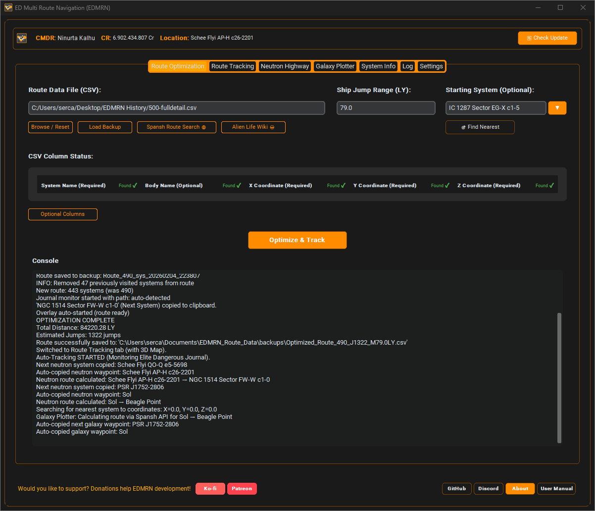
  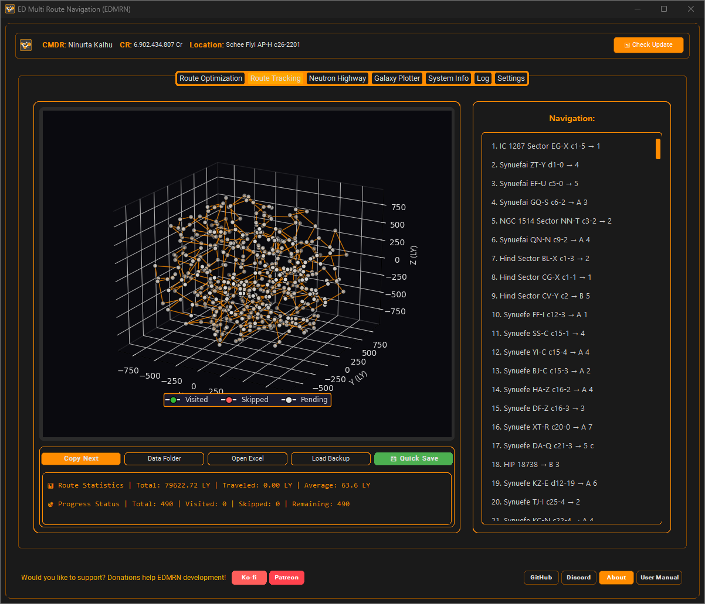
  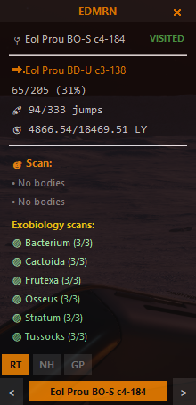
</p>

> Explore the full visual tour below, including System Info, Log Viewer, Galaxy Plotter, Settings and the in-game overlay.

---

#  Download EDMRN

## Windows - Recommended

###  Download the latest release

**[ DOWNLOAD EDMRN](https://github.com/NinurtaKalhu/Elite-Dangerous-Multi-Route-Optimizer/releases)**

No installer is required.

### Quick Start

1. Download `EDMRN_v3.3.exe` from the official GitHub Releases page.
2. Run the executable.
3. That's it.

**No Python installation required.**
**No dependency installation required.**
**Fully portable.**

EDMRN can run from any location because the pre-built executable includes its required dependencies.

---

#  What Can EDMRN Do?

##  Exploration & Exobiology

Build a route containing large numbers of systems with [Spansh](https://www.spansh.co.uk/bodies) and let EDMRN optimize the order in which you visit them.

Useful for:

* Exobiology expeditions
* Biological and geological routes
* Long-distance exploration
* POI hunting
* Custom exploration tours
* Multi-system sightseeing routes

EDMRN can track your progress automatically as you move through the galaxy.

---

##  Multi-Route Optimization

When your route contains many systems, manually deciding the order can become inefficient.

EDMRN uses a TSP-based optimization engine to calculate efficient routes between systems.

Features include:

* Shortest-route optimization
* Configurable starting system
* Fixed start/end points
* Ship jump-range awareness
* Total distance calculation
* Jump-count calculation
* Route comparison
* Interactive 3D visualization

The optimization engine is based on a custom reimplementation of the **Lin-Kernighan (LK)** approach.

On modern hardware, routes containing **500+ systems** can be optimized in seconds, depending on route complexity and hardware.

---

#  Neutron Highway

Travelling long distances?

Use EDMRN's Neutron Highway tools to calculate routes using neutron star FSD boosts.

Features include:

* Source and destination selection
* System autocomplete
* Ship jump-range configuration
* Fuel tank capacity
* Neutron boost efficiency settings
* Route optimization
* Jump statistics
* Route export
* Clipboard support

EDMRN also supports neutron-aware optimization inside the Custom Route Planner.

---

#  Custom Route Planner

The Custom Route Planner gives you direct control over your route.

### Add systems by:

* System name
* Autocomplete
* Manual coordinates `(X, Y, Z)`

### Optimize with:

* TSP shortest-path mode
* Neutron Path mode
* Configurable starting system
* Fixed start/end systems

### Manage your route:

* Click to select systems
* Batch-remove selected systems
* Clear all systems
* View current / selected / pending states
* Navigate using Previous / Next

### Route information:

* Light-year distance
* Jump count
* Neutron jump comparison
* Ship FSD jump range
* Route visualization

### Import / Export:

* CSV with full metadata

### Overlay integration:

* Custom Route tab available inside the overlay
* Previous / Next navigation
* Automatic copying of system names to clipboard
* Optional automatic overlay startup after optimization

---

#  Real-Time Fuel Tracker

EDMRN includes real-time fuel monitoring.

### Automatic detection

EDMRN can detect:

* Current fuel level from `Status.json`
* Ship fuel capacity from the journal `Loadout` event
* On-foot status
* Current CMDR information

### Fuel display

Fuel is displayed in both the main application and the in-game overlay.

Example:

`Fuel: 85% (13.6/16.0t)`

When on foot:

`Fuel: On Foot`

### Visual indicators

Fuel status uses configurable warning levels:

*  Above 50%
*  25-50%
*  15-25%
*  Below 15%

Fuel information is updated in real time.

### Audio alerts

Configure:

* Warning threshold: 5-30%
* Critical threshold
* Sound enable/disable
* System volume

Audio alerts use WAV notifications with a cooldown to prevent repeated warnings.

---

#  Automatic Journal Tracking

EDMRN can monitor the Elite Dangerous journal in real time.

This allows the application to automatically detect:

* Current system
* Commander changes
* Ship changes
* Jump events
* Route progress
* Visited systems

### Journal features

* Automatic journal discovery
* Manual journal path configuration
* Multiple commander support
* Real-time updates
* Connection test
* Journal caching
* Background processing

Your exploration progress can continue across sessions.

---

#  Interactive 3D Route Visualization

EDMRN provides a real-time 3D view of your route.

You can:

* Zoom
* Rotate
* Pan
* Inspect route geometry
* Follow current position
* Visualize large system collections

The route view updates as journal events are received.

---

#  In-Game Overlay

Keep EDMRN visible while playing Elite Dangerous without constantly switching windows.

### Overlay displays:

| Component        | Description                             |
| ---------------- | --------------------------------------- |
| Current System   | Your current location                   |
| Next Target      | Next system in the route                |
| Bodies to Scan   | Relevant biological/geological targets  |
| Progress Tracker | Visited / skipped / remaining           |
| Distance Stats   | Traveled and remaining distance         |
| Route Info       | Total systems and completion percentage |
| Fuel Tracker     | Live fuel percentage and status         |

### Overlay controls

* **Ctrl+O** - Show / hide
* Drag - Reposition
* Small / Medium / Large - Resize
* 50-100% - Opacity
* Always-on-top support
* Automatic launch option

### Recommended setup

For best compatibility:

* Use **Borderless Window** mode in Elite Dangerous
* Place the overlay away from critical HUD elements
* Disable VSync if additional overlay responsiveness is required

### GeForce NOW support

EDMRN includes features for cloud gaming environments:

* Borderless mode detection
* Automatic overlay launch
* Optimized window handling

---

#  System Information

The System Info tab provides detailed information about the current or selected system.

### Includes:

* System information
* Statistics
* Exobiology findings
* Celestial bodies
* Surface details
* Stations
* Exploration information
* System history
* Galactic Mapping Project information

System lookup uses community data services including:

* Spansh
* EDSM
* EDAstro / GEC

---

#  Journal Log Viewer

EDMRN includes a dedicated Log tab for inspecting Elite Dangerous journal data.

### Features

* Time-range filtering
* Text search
* Column selection
* Column resizing / auto-sizing
* Pinned columns
* Custom icons
* Note annotations
* Detailed row view
* Two-column detail panel
* Quick copy
* Tooltips
* Context menu
* Cached journal processing
* Append-only updates
* Background processing

Large logs are handled using caching and incremental updates to reduce UI freezes.

---

#  Visit History

EDMRN remembers your exploration history.

### Features

* Persistent system visit tracking
* Automatic visit detection
* Survives application restarts
* Survives route changes
* Duplicate prevention
* Historical exploration tracking

Your previous journey remains useful even after creating a new route.

---

#  Smart Save, Backup & Recovery

Long expeditions should not be lost because of a corrupted file.

EDMRN includes a backup and recovery system.

### Auto-save / Save / Backup

> [!WARNING]
> This is no longer necessary, because EDMRN uses an atomic recording system and every step is recorded instantly. Thanks to this, nothing is lost even in the event of a power outage.

Choose:

* 1 minute
* 5 minutes
* 10 minutes
* Never

You can also trigger a manual save with:

`Ctrl+S`

### Backup protection

Before important operations, EDMRN can:

* Create automatic backups
* Use atomic file operations
* Detect corrupted data
* Attempt recovery
* Preserve previous route states

---

#  Galaxy Plotter

EDMRN integrates with the **Spansh Exact Router**.

Use it for advanced galaxy route planning with:

* Ship configuration
* Neutron boosts
* Route preferences
* Fuel calculations
* Navigation export

Ship builds can be supplied using:

* Coriolis.io
* EDSY.org

EDMRN can calculate more precise fuel requirements based on the selected ship configuration.

---

#  Smart System Autocomplete

System search integrates with community galaxy databases.

**Spansh** and **EDSM**

Features include:

* Fast suggestions
* Minimum 3-character search
* 300 ms debounce
* Smart caching
* Fallback search
* Coordinate lookup

Autocomplete is designed to reduce unnecessary API requests while keeping the search responsive.

---

#  11 PowerPlay Themes

EDMRN includes 11 built-in themes inspired by Elite Dangerous factions.

### Available themes

* Elite Dangerous
* Aisling Duval
* Archon Delaine
* Arissa Lavigny-Duval
* Denton Patreus
* Edmund Mahon
* Felicia Winters
* Li Yong-Rui
* Pranav Antal
* Zachary Hudson
* Zemina Torval

Themes use JSON-based definitions and are applied automatically after restart.

The interface is designed around a dark, high-contrast aesthetic suitable for long exploration sessions.

---

#  Advanced Configuration

## Overlay

* Start / Stop
* Opacity
* Size
* Position
* Auto-launch
* Position memory
* Keyboard toggle

## Journal

* Automatic path detection
* Custom path
* Multiple commanders
* Real-time updates
* Connection testing

## Auto-Save

> [!WARNING]
> This is no longer necessary, because EDMRN uses an atomic recording system and every step is recorded instantly. Thanks to this, nothing is lost even in the event of a power outage.

* 1 / 5 / 10 minutes
* Disable option
* Countdown indicator
* Manual save
* Automatic backup
* Recovery

## Route Optimization

* Starting system
* Jump range precision to 0.01 LY
* Backup management
* CSV export
* Log verbosity

---

> [!IMPORTANT]
> This step of creating your ".CSV" file on [SPANSH](https://www.spansh.co.uk/bodies) is the most important part of being able to use EDMRN.

#  Quick Start

## Step 1 - Create your route

Use **Spansh.co.uk** to create your system list.

Export a CSV containing:

```text
System Name
X
Y
Z
```

Optional:

```text
Body Name
```
> [!TIP]
> `Body Name` is recommended for biological and geological exploration routes.

Only `System Name`, `X`, `Y`, and `Z` are required.

---

## Step 2 - Optimize

1. Open EDMRN.
2. Select your CSV with **Browse**.
3. Enter your ship's jump range.
4. Optionally choose a starting system.
5. Click **Optimize Route and Start Tracking**.
6. Wait for optimization to complete.

EDMRN will calculate the route and prepare it for live tracking.

---

## Step 3 - Track your journey

Once you start travelling:

* Your current system is detected automatically.
* Visited systems are updated from the journal.
* Route progress is shown visually.
* You can manually mark systems as visited or skipped.

### Quick actions

* **Copy Next**
* **Data Folder**
* **Open Excel**
* **Load Backup**

---

## Step 4 - Optional: Neutron Highway

1. Enter source and destination.
2. Select your jump range.
3. Enter fuel tank capacity.
4. Select neutron mode and efficiency.
5. Click **Calculate Route**.
6. Export or copy the result.

---

## Step 5 - Optional: Galaxy Plotter

1. Open Galaxy Plotter.
2. Select your ship build.
3. Configure route preferences.
4. Enable neutron boosts when appropriate.
5. Calculate the route.
6. Export it for navigation.

---

## Step 6 - Start the Overlay

Go to:

**Settings -> Overlay**

Then:

1. Click **Start Overlay**
2. Select the preferred opacity and size
3. Position the overlay
4. Run Elite Dangerous in Borderless Window mode
5. Press **Ctrl+O** to show or hide the overlay

The overlay can display your:

* Current system
* Next target
* Scan targets
* Distance
* Progress
* Fuel

---

## Step 7 - Choose a Theme

Go to:

**Settings -> Appearance**

Select one of the 11 PowerPlay themes.

EDMRN automatically restarts to apply the selected theme.

---

<details>
<summary><strong> System Requirements</strong></summary>

#  System Requirements


## Minimum

* **OS:** Windows 10 / 11 64-bit
* **RAM:** 4 GB
* **Storage:** 200 MB or higher free space
* **Elite Dangerous:** Journal logging enabled

For source installation:

* Python 3.12+
* pip
* Git

## Recommended

* **OS:** Windows 11 64-bit
* **RAM:** 8 GB
* **Monitor:** 1920x1080 or higher
* **Elite Dangerous:** Borderless Window mode for overlay

## Elite Dangerous Settings

Journal logging should be enabled.

Default journal location:

```text
%USERPROFILE%\Saved Games\Frontier Developments\Elite Dangerous\
```

---

</details>

<details>
<summary><strong> Running From Source</strong></summary>

#  Running From Source


EDMRN can also be run directly from source.

## Requirements

* Python 3.12+
* pip
* Git

## Install

```bash
git clone https://github.com/NinurtaKalhu/Elite-Dangerous-Multi-Route-Optimizer.git

cd Elite-Dangerous-Multi-Route-Optimizer

pip install -r requirements.txt

python run.py
```

## Build the Windows executable

Install PyInstaller:

```bash
pip install pyinstaller
```

Then run:

```bash
build_edmrn.bat
```

---

</details>

<details>
<summary><strong> Optimization Engine Details</strong></summary>

#  The Optimization Engine


> **"Light doesn't choose the shortest path... it chooses the fastest."**

EDMRN is built around the idea that navigation is fundamentally an optimization problem.

The route engine uses a custom reimplementation of the **Lin-Kernighan (LK)** algorithm and TSP-based optimization techniques.

The project takes inspiration from the work of:

### Brian Kernighan

Co-creator of C, Unix and AWK, whose work at Bell Labs helped establish the foundations of modern computing.

### Shen Lin

The mathematician whose work with Kernighan helped establish the variable n-opt heuristic approach associated with the TSP.

EDMRN's optimization engine has been refined to handle large exploration routes efficiently.

---

</details>

<details>
<summary><strong> API Credits & Community Services</strong></summary>

#  API Credits & Community Services


EDMRN would not exist without the Elite Dangerous community's excellent data services.

## Spansh

Used for:

* Neutron Highway routing
* Galaxy Plotter / Exact Router
* System autocomplete
* Route planning
* System data

EDMRN uses:

* 300 ms autocomplete debounce
* 1-hour caching
* Minimum 3-character search requirement

**Website:** https://www.spansh.co.uk/

Attribution is provided in accordance with Spansh's terms.

---

## EDSM

Used for:

* System autocomplete fallback
* System information
* System statistics
* Celestial body data
* Station information
* Coordinates

EDMRN uses:

* Smart caching
* Request batching
* Long-term caching for static data
* Fallback mechanisms
* Rate-aware API usage

**Website:** https://www.edsm.net/

Attribution is provided in accordance with EDSM's terms.

---

## EDAstro / GEC

Used for:

* Galactic Mapping Project data
* System history
* Points of interest
* System-specific GEC information

**Website:** https://edastro.com/

Data is used under **CC BY-NC-SA 3.0**.

Special thanks to **CMDR Orvidius** for maintaining the GEC API.

---

## Responsible API Usage

EDMRN is designed to be respectful of community infrastructure.

It implements:

* Smart caching
* Request debouncing
* Proper User-Agent headers
* Rate limiting
* Fallback mechanisms
* Reduced redundant requests

> **EDMRN is not affiliated with Spansh, EDSM or EDAstro.**
>
> We are grateful to these services and their maintainers.

---

</details>

<details>
<summary><strong> Security & Privacy</strong></summary>

#  Security & Privacy


EDMRN is designed to keep commander data local.

##  What EDMRN Does

* Reads Elite Dangerous journal files locally
* Reads the journal in read-only fashion
* Saves route information locally
* Creates the in-game overlay
* Copies system names to the clipboard when requested
* Checks GitHub for application version updates
* Uses Spansh / EDSM / EDAstro APIs for supported features

##  What EDMRN Does Not Do

*  No telemetry collection
*  No analytics collection
*  No personal information harvesting
*  No game memory manipulation
*  No DLL injection
*  No automated keyboard or mouse input
*  No third-party data sharing
*  No online account required
*  No background process remains after the application is closed

## Local Data

EDMRN stores data locally in:

```text
%USERPROFILE%\Documents\EDMRN_Route_Data\
```

Including:

```text
EDMRN_Route_Data\
|--- backups\
|--- logs\
`--- settings.json
```

There is no cloud storage for EDMRN route data.

**Your route data stays on your PC.**

---

</details>

#  Antivirus False Positives

Some antivirus programs may flag PyInstaller-built applications.

This does **not automatically mean the application is malicious**.

PyInstaller applications bundle a Python runtime and can trigger heuristic detections, particularly when an executable is relatively new or has limited distribution.

## Recommended verification

1. Download EDMRN only from the official GitHub Releases page.
2. Check the release hash when provided.
3. Scan the executable with VirusTotal.
4. Run from source if you prefer maximum transparency.

VirusTotal:

https://www.virustotal.com/

Never download EDMRN executables from unofficial mirrors.

---

#  Performance Tips

For large route optimizations:

* Close unnecessary applications
* Prefer SSD storage
* Keep unnecessary browser tabs closed
* Periodically remove old backups
* Avoid heavy background workloads during optimization

---

#  Support & Community

Need help or want to report a problem?

### Discord

**EDMRN Community**

https://discord.gg/DWvCEXH7ae

Fastest place for support and community discussion.

### GitHub Issues

Report bugs and technical problems through GitHub Issues.

### Email

**[ninurtakalhu@gmail.com](mailto:ninurtakalhu@gmail.com)**

### Wiki

Detailed documentation and tutorials are planned for the project wiki.

---

<details>
<summary><strong> Project Architecture</strong></summary>

#  Project Architecture


EDMRN uses a modular architecture designed to separate UI, routing, journal processing, navigation and data services.

The project contains 35+ functional modules and a larger set of supporting components.

```text
EDMRN_v3.3/
|--- edmrn/
|   |--- app.py
|   |--- app_window.py
|   |--- galaxy_handler.py
|   |--- journal_handler.py
|   |--- custom_route.py
|   |--- fuel_tracker.py
|   |--- exobiology.py
|   |--- journal_cache.py
|   |--- log_viewer.py
|   |--- system_info_section.py
|   |--- optimizer.py
|   |--- tracker.py
|   |--- minimap.py
|   |--- overlay.py
|   |--- journal.py
|   |--- journal_operations.py
|   |--- logger.py
|   |--- backup.py
|   |--- autosave.py
|   |--- platform_detector.py
|   |--- exceptions.py
|   |--- utils.py
|   |--- config.py
|   |--- gui.py
|   |--- ui_components.py
|   |--- theme_manager.py
|   |--- theme_editor.py
|   |--- ed_theme.py
|   |--- route_management.py
|   |--- settings_manager.py
|   |--- neutron_manager.py
|   |--- neutron.py
|   |--- galaxy_plotter.py
|   |--- file_operations.py
|   |--- system_autocomplete.py
|   |--- autocomplete_entry.py
|   |--- edmrn_sheet.py
|   |--- column_display_names.py
|   |--- codex_translation.py
|   |--- slef_store.py
|   |--- icons.py
|   |--- updater.py
|   |--- visit_history.py
|   |--- visit_history_dialog.py
|   |--- themes/
|   |   |--- elite_dangerous.json
|   |   |--- aisling_duval.json
|   |   |--- archon_delaine.json
|   |   |--- arissa_lavigny_duval.json
|   |   |--- denton_patreus.json
|   |   |--- edmund_mahon.json
|   |   |--- felicia_winters.json
|   |   |--- li_yong_rui.json
|   |   |--- pranav_antal.json
|   |   |--- zachary_hudson.json
|   |   `--- zemina_torval.json
|   `--- __init__.py
|--- assets/
|   |--- explorer_icon.ico
|   `--- explorer_icon.png
|--- main.py
|--- run.py
|--- setup.py
|--- edmrn.spec
|--- build_clean.bat
|--- requirements.txt
|--- LICENSE
`--- README.md
```

---

</details>

<details>
<summary><strong> Development Highlights</strong></summary>

#  Development Highlights


## v3.3.0

* Fuel Tracker
* Custom Route Planner
* System Info tab
* Advanced Log tab
* Journal performance improvements
* New modular architecture
* Overlay improvements
* Thread-safe operations
* EDSM API fixes
* Galaxy Plotter request handling
* MiniMap fixes
* Autocomplete improvements
* Journal-based jump-range detection

## v3.2.x

* Persistent Visit History
* Smart Backup and Recovery
* GeForce NOW overlay support
* Borderless mode handling
* Nearest System Finder
* API rate limiting improvements
* Request optimization

## v3.0 Foundation

* Complete architecture redesign
* 35+ independent modules
* Thread-safe design
* 11-theme system
* Advanced route optimization
* Neutron Highway integration
* Galaxy Plotter integration
* Real-time 3D visualization

---

</details>

<details>
<summary><strong> Version History</strong></summary>

#  Version History


## v3.3.0 - Current Release

* System Info
* Advanced Log Viewer
* Enhanced tables and detail panels
* Exobiology data
* Body and station information
* Journal caching
* Tail-based log updates
* Background processing
* UI freeze fixes
* Improved stability
* Modernized themes and UI

## v3.1.0

* Visit History
* Smart Backup
* GeForce NOW overlay support
* Borderless mode
* Enhanced autocomplete
* API optimizations
* Improved dropdown UX
* Spansh / EDSM attribution
* Galaxy Plotter integration
* Precise fuel calculations
* Coriolis / EDSY ship build integration
* Enhanced neutron routing

## v3.0.0 - Major Redesign

* Complete modular architecture
* 11-theme system
* Backup restructuring
* Overlay redesign
* Thread-safe architecture

---

</details>

#  Support Development

EDMRN is free and open-source.

If EDMRN improves your Elite Dangerous experience, you can support continued development.

### Ko-fi

One-time support:

https://ko-fi.com/

### Patreon

Monthly support:

https://www.patreon.com/

Your support helps fund:

* Maintenance
* New features
* Performance improvements
* Faster support
* Community tools
* Open-source development
* Ad-free distribution

---

#  Developer

## CMDR Ninurta KALHU

Solo developer and Elite Dangerous commander.

Passionate about exploration, route optimization and building tools for the Elite Dangerous community.

### Connect

* **GitHub:** https://github.com/NinurtaKalhu
* **Discord:** https://discord.gg/DWvCEXH7ae
* **Email:** [ninurtakalhu@gmail.com](mailto:ninurtakalhu@gmail.com)
* **X:** @NinurtaKalhu

### Development Stats

* Project started: **2025**
* 20,000+ lines of code
* 46+ modules
* 11 themes
* Built with Python and CustomTkinter

---

#  License

EDMRN is released under:

**GNU Affero General Public License v3.0 - AGPL-3.0-only**

## You CAN

* Use EDMRN for personal or commercial purposes
* Share EDMRN with others

## You MUST

* Keep derivative works under AGPL-3.0-only
* Provide source code when distributing modified versions
* Provide source code when running modified EDMRN as a network service
* Include copyright and license notices

## You CANNOT

* Re-license the project under incompatible terms
* Hold the developer liable for issues
* Use the developer's name for endorsements without permission

Full license:

https://github.com/NinurtaKalhu/Elite-Dangerous-Multi-Route-Optimizer/blob/main/LICENSE

---

#  Screenshots & Visual Tour

> A quick look at EDMRN's route planning, tracking, system information, log analysis, settings and in-game overlay.

##  Route Planning & Tracking

<p align="center">
  
</p>

**Route Optimization** - CSV import with TSP / LK optimization.

<p align="center">
  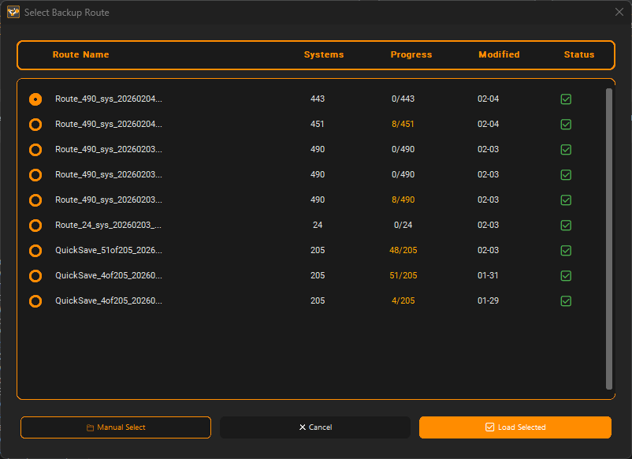
</p>

**Load Backup** - Restore a previously saved route.

<p align="center">
  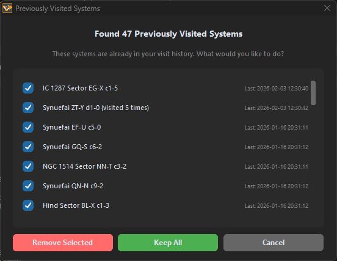
</p>

**Visited Systems** - Keep track of exploration progress.

<p align="center">
  
</p>

**Route Tracking** - Interactive 3D route map with real-time journal tracking.

---

##  Advanced Navigation

### Neutron Highway

The current README does not provide a dedicated Neutron Highway screenshot; no new image filename is invented here.

### Galaxy Plotter

<p align="center">
  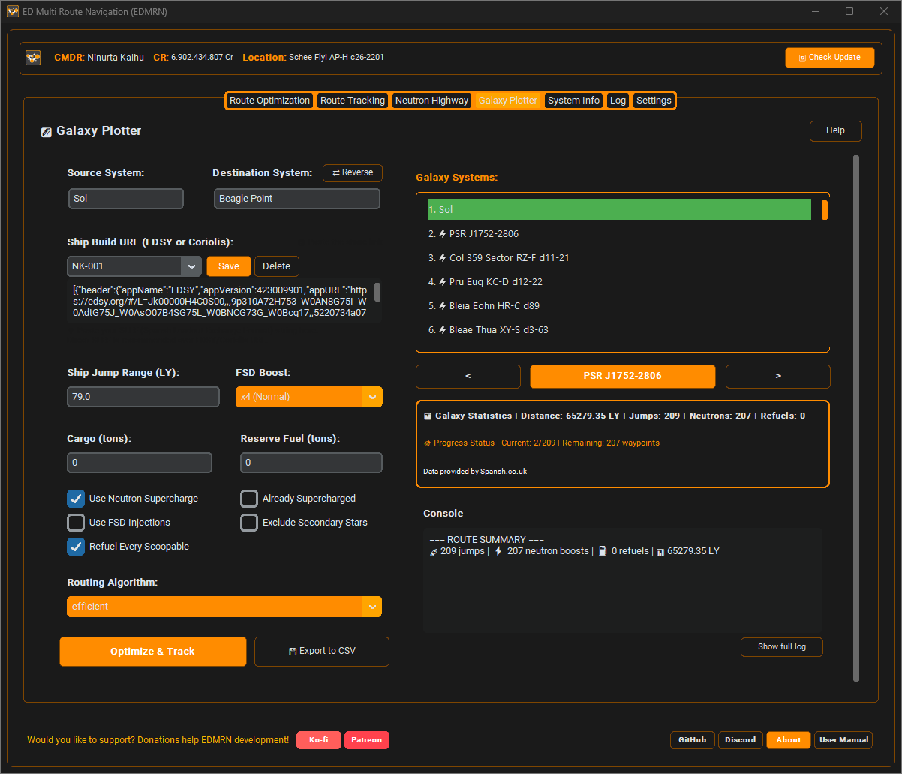
</p>

---

##  System Information

<p align="center">
  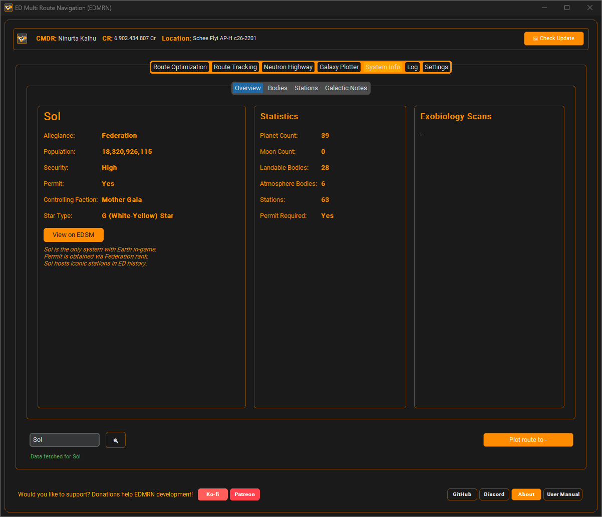
</p>

**System information**

<p align="center">
  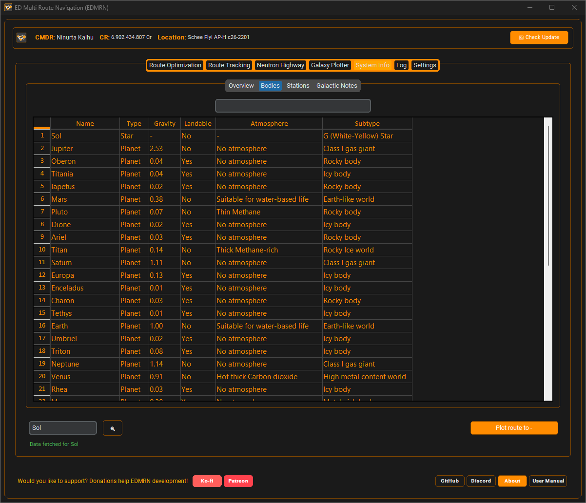
</p>

**Exobiology / bioscan information** and celestial body information.

<p align="center">
  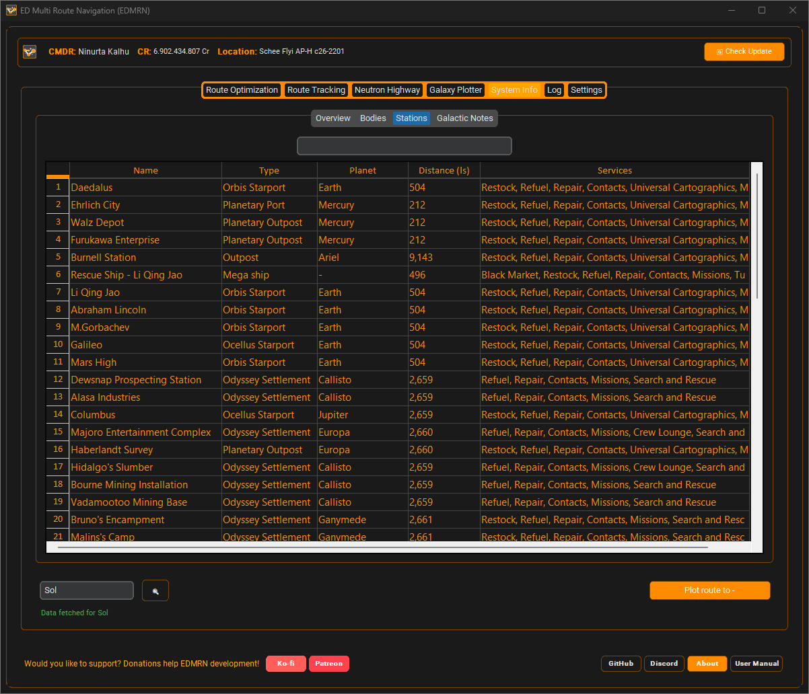
</p>

**Station information**

<p align="center">
  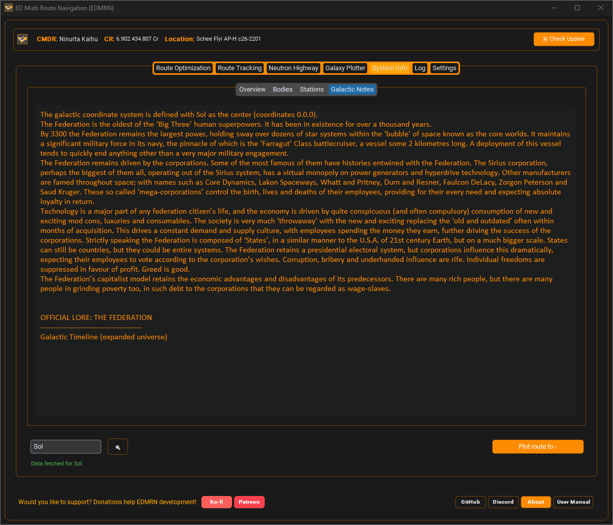
</p>

**System history**

---

##  Log Viewer

<p align="center">
  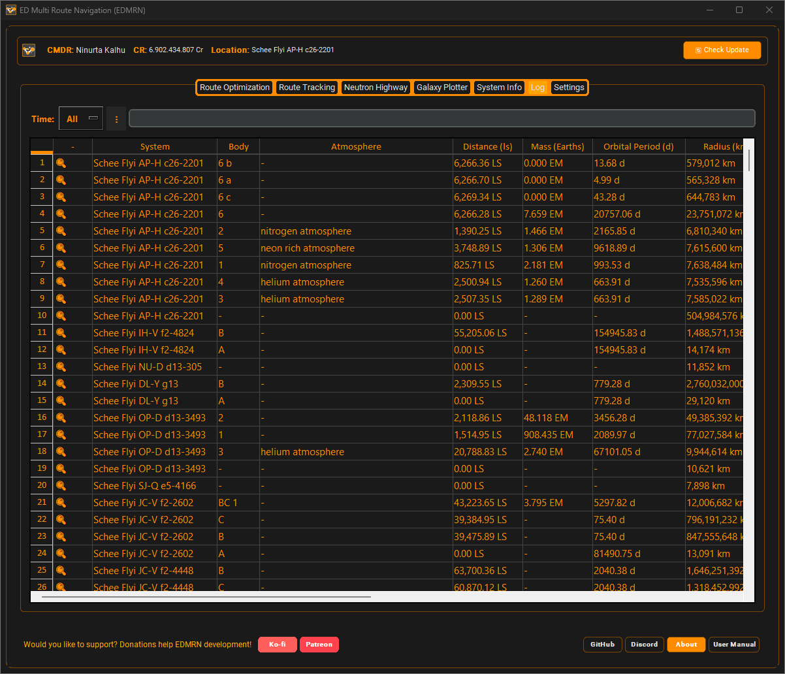
</p>

**Log information**

<p align="center">
  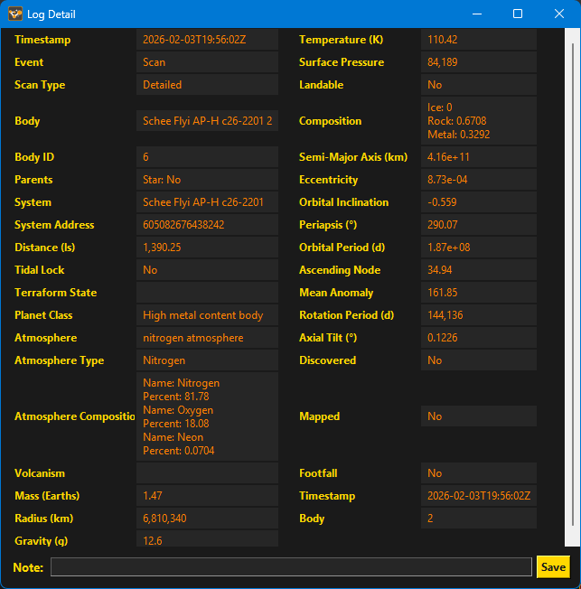
</p>

**Detailed log view**

<p align="center">
  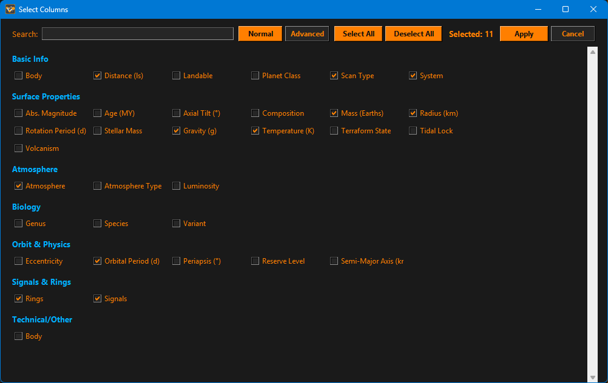
</p>

**Column selection**

<p align="center">
  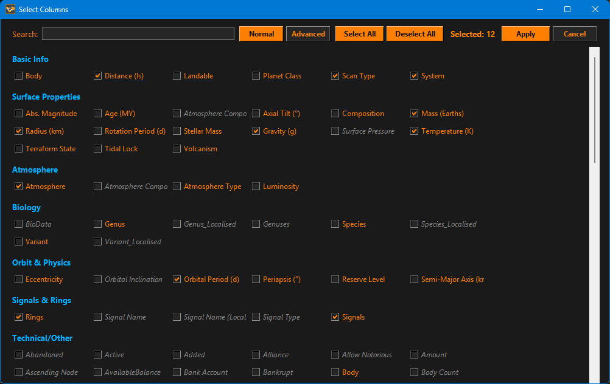
</p>

**Advanced detail view**

---

##  Settings & Customization

<p align="center">
  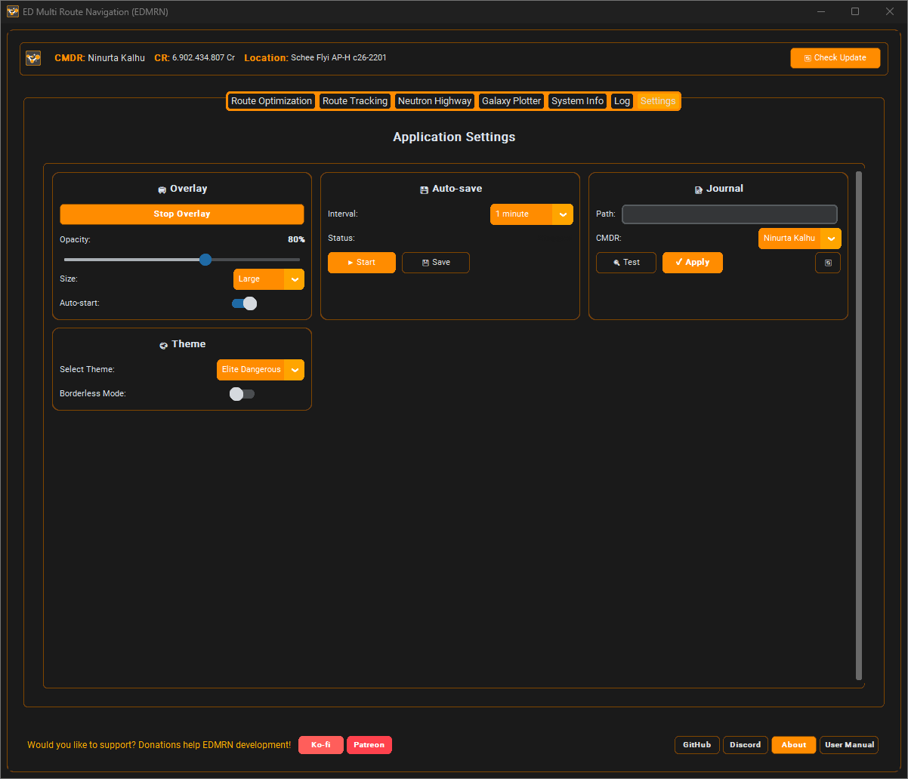
</p>

**Comprehensive configuration**, including overlay, route, journal and appearance settings.

---

##  In-Game Experience

<p align="center">
  
</p>

Transparent in-game overlay with multiple tabs for:

* Real-time route progress
* Exploration navigation
* Fuel information
* VR / GeForce NOW workflows

---

##  About

<p align="center">
  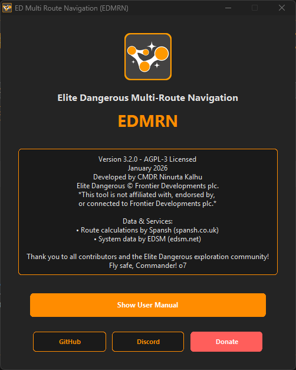
</p>

*Version information and credits.*

---
#  Quick Links

| Resource              | Link                                                                           |
| --------------------- | ------------------------------------------------------------------------------ |
|  GitHub Repository  | https://github.com/NinurtaKalhu/Elite-Dangerous-Multi-Route-Optimizer          |
|  Latest Release     | https://github.com/NinurtaKalhu/Elite-Dangerous-Multi-Route-Optimizer/releases |
|  Discord            | https://discord.gg/DWvCEXH7ae                                                  |
|  Bug Reports        | https://github.com/NinurtaKalhu/Elite-Dangerous-Multi-Route-Optimizer/issues   |
|  Documentation      | GitHub Wiki                                                                    |
|  Support Development | Ko-fi                                                                          |

---

#  Acknowledgments

## Data Providers

Special thanks to:

* **EDAstro**
* **EDSM**
* **Spansh**

Without these community services, many EDMRN features would not be possible.

## Elite Dangerous Community

* Frontier Developments - for creating Elite Dangerous
* Elite Dangerous Community Developers (EDCD)
* Commanders who provided feedback
* Community members who tested EDMRN
* Everyone who shared the project with other commanders

## Open Source

EDMRN is built using open-source technologies including:

* Python
* CustomTkinter
* Matplotlib
* SciPy
* Requests

Special thanks to everyone who contributes to the open-source ecosystem.

---

#  Built for Explorers

EDMRN was created with one simple idea:

> **Your time in the black is valuable.**

Plan your route.

Optimize your journey.

Track your discoveries.

Keep your next destination in sight.

And spend more time **exploring**, not managing spreadsheets.

---

## Fly safe, Commander! o7

> **"In the black, every lightyear counts."**

Made with  by **Ninurta Kalhu** for the Elite Dangerous community.

**EDMRN v3.3.0 - June 2026 - AGPL-3.0**


*Version info and credits*
